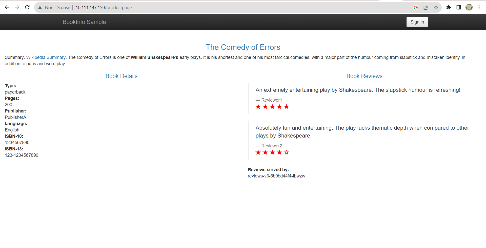
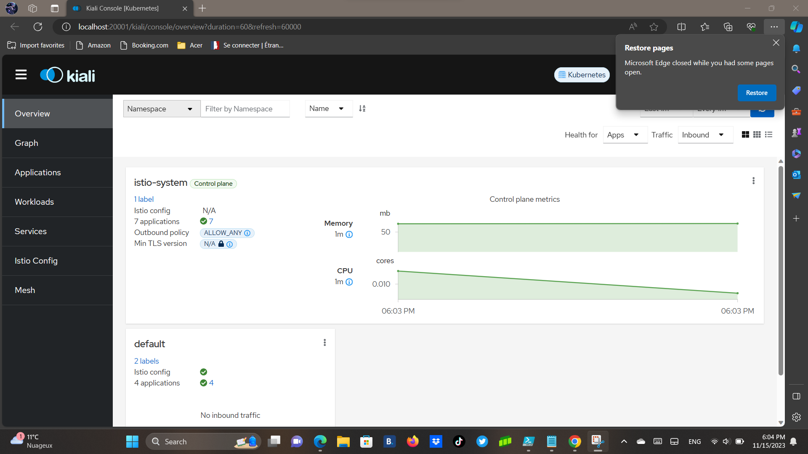
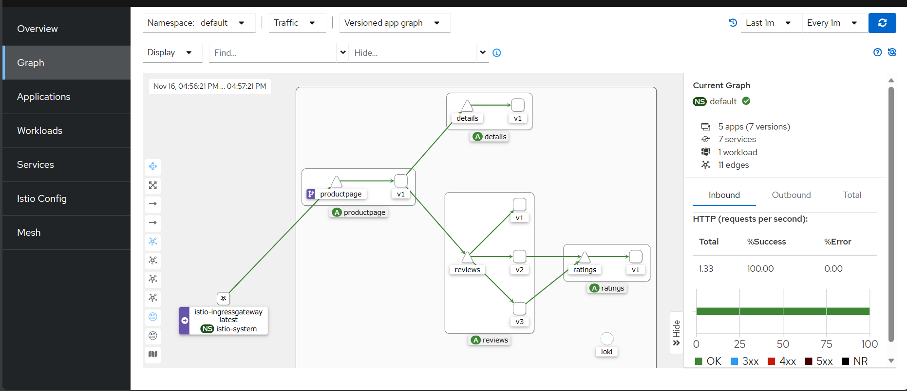
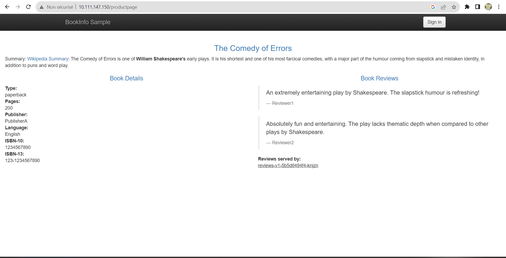
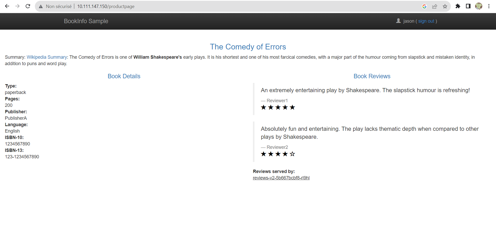
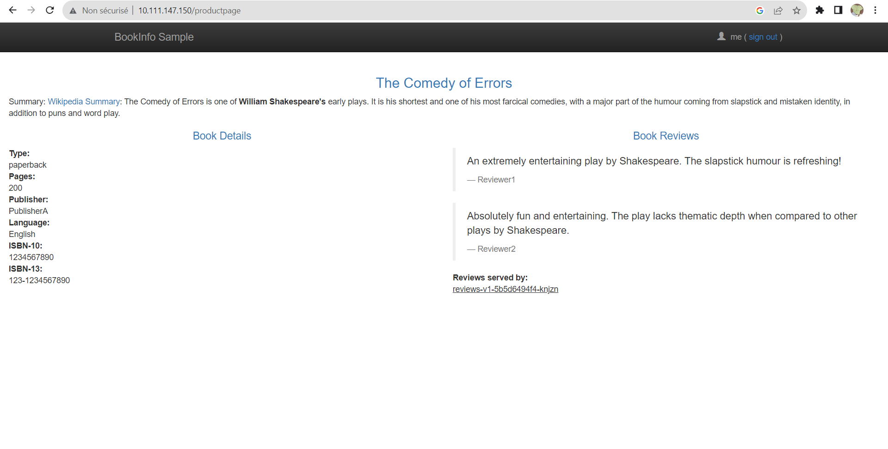
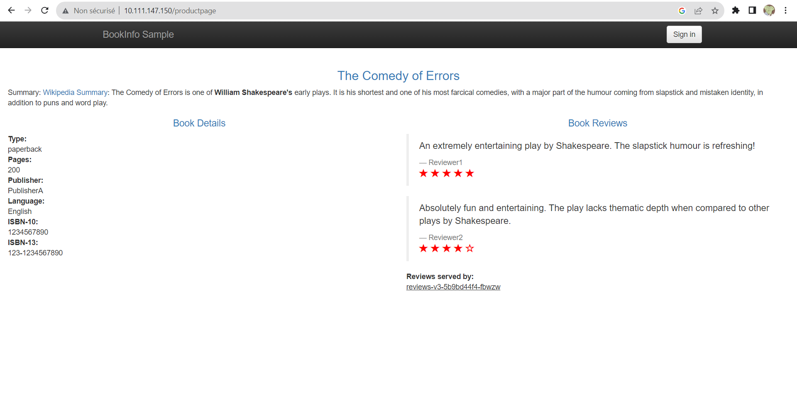
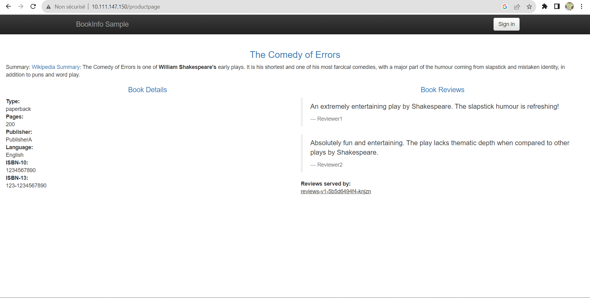
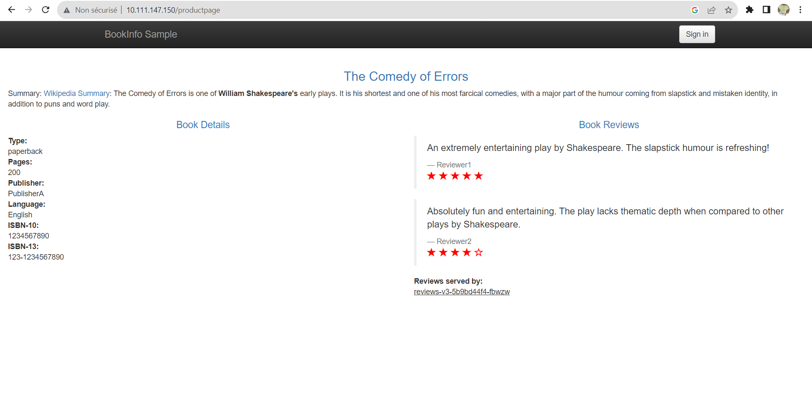

## Prérequis 

1. Suivez les instructions suivantes pour installer minikube suivant votre OS [Installez Minikube](https://kubernetes.io/docs/tasks/tools/install-minikube/)
2. Après l'installation de Minikube effectuez :

- `minikube config set vm-driver virtualbox` (or `vmware`, or `kvm2`)
- `minikube start --memory=16384 --cpus=4 --kubernetes-version=v1.18.0`

Entrez la commande suivante et regarder si les services sont en cours d'exécution : 

```bash
minikube status
```
## Fonctionnement 

## 1. Premiers pas avec Istio

1. Téléchargement et installation d'Istio

- Verifier que vous avez Minikube et Docker configurés
- Télécharger la derniere version disponible grace à la commande : 
curl -L https://istio.io/downloadIstio | sh -   
( Linux et Mac )
Pour Windows se référer au site officiel 
- Se rendre dans le dossier contenant votre installation 
- Ajouter le client Istio à votre Path afin de rendre les commandes disponibles globalement. ( Cette configuration est temporaire )
```bash
export PATH=$PWD/bin:$PATH
```  
( Linux et Mac )
```bash
$env:PATH += ";C:\YourPathToIstio\istio-1.19.3\bin"
```
   ( Windows )
- Verifier les modifications
```bash
istioctl
```  
- Installer Istio sous un profile configuré en mode demo
```bash
istioctl install --set profile=demo -y
```  
- Ajouter un label afin d'indiquer à Istio de toujours injecter les proxies Envoy sidecar lors du deployement pour plus tard
```bash
kubectl label namespace default istio-injection=enabled
``` 
Affichage 
```bash
namespace/default labeled
```  

2. Deployement de l'extrais d'application

- Deployer l'extrais d'application BookInfo
```bash
kubectl apply -f samples/bookinfo/platform/kube/bookinfo.yaml
```  

- L'application va démarrer. Le sidecar Istio sera déployé au coté de tous les pods et services.
```bash
kubectl get services
```  

```bash
kubectl get pods
```  

( Attendre que tous les pods soient prets 2/2 et status Running avant de passer à l'étape suivante )

- Vérifier que l'application fonctionne à l'intérieur du cluster en utilisant cette commande ( Titre de la page en réponse ) 

```bash
kubectl exec "$(kubectl get pod -l app=ratings -o jsonpath='{.items[0].metadata.name}')" -c ratings -- curl -sS productpage:9080/productpage | grep -o "<title>.*</title>" 
```  
   ( Linux et Mac )

```bash
kubectl exec "$(kubectl get pod -l app=ratings -o jsonpath='{.items[0].metadata.name}')" -c ratings -- curl -sS productpage:9080/productpage | Select-String -Pattern '<title>.*</title>' 
```  
  ( Alternative PowerShell )

Affichage
```bash
<title>Simple Bookstore App</title>
```  


3. Ouvrir l'application au traffic exterieur ( Pour l'instant elle est déployée mais pas accessible de l'exterieur )

- Associer l'application au gateway Istio
```bash
kubectl apply -f samples/bookinfo/networking/bookinfo-gateway.yaml
```  
Affichage
```bash
gateway.networking.istio.io/bookinfo-gateway created
virtualservice.networking.istio.io/bookinfo created
``` 

- Vérifier qu'il n'y a pas de problème avec la configuration
```bash
istioctl analyze
```  
Affichage
```bash
✔ No validation issues found when analyzing namespace: default.
``` 

4. Déterminer les IP et ports ingress

- Pour Minikube
- Lancer cette commande dans un nouveau terminal pour démarrer un tunnel Minikube qui envoie du traffic au gateway Ingress
```bash
minikube tunnel
```  
- Mettre en place les hosts et ports Ingress
```bash
export INGRESS_HOST=$(kubectl -n istio-system get service istio-ingressgateway -o jsonpath='{.status.loadBalancer.ingress[0].ip}')
export INGRESS_PORT=$(kubectl -n istio-system get service istio-ingressgateway -o jsonpath='{.spec.ports[?(@.name=="http2")].port}')
export SECURE_INGRESS_PORT=$(kubectl -n istio-system get service istio-ingressgateway -o jsonpath='{.spec.ports[?(@.name=="https")].port}')   
```  
   ( Linux, MacOs et Bash )
```bash
# Get INGRESS_HOST
$env:INGRESS_HOST = (kubectl -n istio-system get service istio-ingressgateway -o jsonpath='{.status.loadBalancer.ingress[0].ip}')
Write-Host "INGRESS_HOST: $env:INGRESS_HOST"
# Get INGRESS_PORT
$env:INGRESS_PORT = (kubectl -n istio-system get service istio-ingressgateway -o jsonpath="{.spec.ports[?(@.name=='http2')].port}")
Write-Host "INGRESS_PORT: $env:INGRESS_PORT"
# Get SECURE_INGRESS_PORT
$env:SECURE_INGRESS_PORT = (kubectl -n istio-system get service istio-ingressgateway -o jsonpath="{.spec.ports[?(@.name=='https')].port}")
Write-Host "SECURE_INGRESS_PORT: $env:SECURE_INGRESS_PORT"
```
   ( Windows )

Notre application possède comme identifiants :
```bash
INGRESS_HOST: 10.111.147.150
INGRESS_PORT: 80
SECURE_INGRESS_PORT: 443
```  

- Verifions qu'une adresse IP et un port on été assignés à chaque variable environnementale
```bash
echo "$INGRESS_HOST"
echo "$INGRESS_PORT"
echo "$SECURE_INGRESS_PORT"
```
- Mettons en place un GATEWAY URL
```bash
export GATEWAY_URL=$INGRESS_HOST:$INGRESS_PORT
```  
  ( Linux et MACOS )

```bash
$env:GATEWAY_URL = "$env:INGRESS_HOST:$env:INGRESS_PORT"
Write-Host "GATEWAY_URL: $env:GATEWAY_URL"
```                                
   ( Windows )
- Récupération du GATEWAY URL
```bash
echo "$GATEWAY_URL"
```  

5. Verifier l'accès externe

- Commande suivante pour récuperer l'adresse externe de notre BookInfo application
```bash
echo "http://$GATEWAY_URL/productpage"
```  
Affichage
```bash
http://10.111.147.150:80/productpage
```  
- Coller l'affichage de la commande precedente dans votre navigateur et confirmer que la page Bookinfo produit est bien présente




6. Observer le dashboard 

Suivre les instructions pour deployer le dashboard Kiali ainsi que Prometheus, Grafana, et Jaeger.

- Installer Kiali et ses add-ons et attendre leur deployement
```bash
kubectl apply -f samples/addons
kubectl rollout status deployment/kiali -n istio-system
```  
Affichage
```bash
Waiting for deployment "kiali" rollout to finish: 0 of 1 updated replicas are available...
deployment "kiali" successfully rolled out
```  
- Acceder au dashboard Kiali
```bash
istioctl dashboard kiali
```  
Affichage


- Affichons un overview des relations entre nos services par la commande
```bash
for i in $(seq 1 100); do curl -s -o /dev/null "http://$GATEWAY_URL/productpage"; done
```  
                  ( Linux et Mac )

```bash
for ($i=1; $i -le 100; $i++) {
    $url = "http://10.111.147.150:80/productpage"
    Invoke-WebRequest -Uri $url | Out-Null
}
```  
              ( Windows )
Affichage



**Résultats :**

- Une application BookInfo disponible à l'adresse http://$GATEWAY_URL/productpage


- Un dashboard Kiali contenant une vue d'ensemble des relations entre nos services


## 2. Request Routing

1.  Avant de commencer vérifier si le CRD gateways.gateway.networking.k8s.io ( Gateway API ) existe. Si ce n'est pas le cas, il utilise kubectl kustomize pour récupérer la configuration du CRD depuis GitHub et l'applique à notre cluster Kubernetes.

Cependant, si le script est correct, il ne produira pas de sortie en cas de succès.
```bash
kubectl get crd gateways.gateway.networking.k8s.io &> /dev/null || \
  { kubectl kustomize "github.com/kubernetes-sigs/gateway-api/config/crd?ref=v0.8.0" | kubectl apply -f -; }
```  
                        ( Linux or Mac )
                        
 Ajoutons une sortie explicite ( sur Windows ) pour indiquer si l'opération a réussi ou échoué :
            
```bash
if (!(kubectl get crd gateways.gateway.networking.k8s.io 2>$null)) {
    kubectl kustomize "github.com/kubernetes-sigs/gateway-api/config/crd?ref=v0.8.0" | kubectl apply -f -
    Write-Host "CRD created or updated successfully."
} else {
    Write-Host "CRD already exists."
}
```  

2. Route to version 1

Avant de commencer definir les versions des services avec Istio ** peut se faire avec le Gateway Api **. 
Créons des règles de destination par defaut avec cette commande.
```bash
kubectl apply -f samples/bookinfo/networking/destination-rule-all.yaml
```  
Affichage
```bash
destinationrule.networking.istio.io/productpage created
destinationrule.networking.istio.io/reviews created
destinationrule.networking.istio.io/ratings created
destinationrule.networking.istio.io/details created
```  

Afficher les règles de destinations avec cette commande
```bash
kubectl get destinationrules -o yaml
```  

- Créons des règles de routes qui envoient du traffic aux versions par défaut des microservices
Commande suivante ** Istio API ** pour router tous les traffics à la v1 de chaque microservice
```bash
kubectl apply -f samples/bookinfo/networking/virtual-service-all-v1.yaml
```  
Affichage 
```bash
virtualservice.networking.istio.io/productpage created
virtualservice.networking.istio.io/reviews created
virtualservice.networking.istio.io/ratings created
virtualservice.networking.istio.io/details created
```  
- Attendre quelques secondes pour les services virtuels de pendre effet puis afficher les routes definies avec la commande suivante 
```bash
kubectl get virtualservices -o yaml
```  
Affichage 
```bash
Correct
```  
On peut aussi afficher les définitions subset correspondantes avec cette commande
```bash
kubectl get destinationrules -o yaml
```  
Nous avons configuré Istio pour router la version v1 des micrservices de BookInfo ** reviews service verion 1 **

3. Testons la nouvelle configuration

Rafraichissons la page /productpage plusieurs fois la partie review n'affiche jamais le nombre d'étoiles car on a configuré tous les traffics sur la version 1 qui ne possède pas cette fonctionnalite 
Affichage 


4. Route basée sur l'identité de l'utilisateur
Changeons la configuration de la route de telle sorte qu'un utilisateur soit routé a une version specifique ** dans ce cas utilisateur Jason sera routé au service reviews:v2 **

- Run cette commande pour activer le mode user-based routing 
```bash
kubectl apply -f samples/bookinfo/networking/virtual-service-reviews-test-v2.yaml
```  
Affichage
```bash
virtualservice.networking.istio.io/reviews configured
```  
- Confirmer la creation de la règle 
```bash
kubectl get virtualservice reviews -o yaml
```  
Affichage
```bash
apiVersion: networking.istio.io/v1beta1
kind: VirtualService
... ( metadatas )
spec:
  hosts:
  - reviews
  http:
  - match:
    - headers:
        end-user:
          exact: jason
    route:
    - destination:
        host: reviews
        subset: v2
  - route:
    - destination:
        host: reviews
        subset: v1

```  

- Sur la page /productpage connectons nous en tant que Jason. On remarque que le rating par étoile apparait a coté de chaque review
Affichage

- Connectons nous en tant qu'un autre utilisateur, toutes les étoiles ont disparues car les utilisateurs autre que Jason sont routés sur reviews:v1
Affichage


5. Comprendre

Dans cette tâche, nous avons utilisé Istio pour diriger 100% du trafic vers la version v1 de chacun des services Bookinfo. Ensuite, nous avons défini une règle pour envoyer sélectivement le trafic vers la version v2 du service "reviews" en fonction d'un en-tête utilisateur personnalisé ajouté à la demande par le service "productpage".

6. Cleanup

Supprimer les regles de routages de l'application
```bash
kubectl delete -f samples/bookinfo/networking/virtual-service-all-v1.yaml
```  
Affichage
```bash
virtualservice.networking.istio.io "productpage" deleted
virtualservice.networking.istio.io "reviews" deleted
virtualservice.networking.istio.io "ratings" deleted
virtualservice.networking.istio.io "details" deleted
```  


**Results:**

- envoi de 100% du traffic à la version `v1` de chaque service de BookInfo
- mise en place d'une règle d'envoi du traffic à la version `v2` du service de chaque review en fonction de l'identifiant

## 3. Traffic Shifting (canary rollout)


1. Apply weight-based routing

- Router tous les traffics a la version v1
```bash
kubectl apply -f samples/bookinfo/networking/virtual-service-all-v1.yaml
```  
Affichage
```bash
virtualservice.networking.istio.io/productpage created
virtualservice.networking.istio.io/reviews created
virtualservice.networking.istio.io/ratings created
virtualservice.networking.istio.io/details created
```  
- Ouvrez la page, aucune étoile ne s'affiche car tous les traffics sont connectés a la version reviews:v1
- Transferez 50% du traffic de reviews:v1 à reviews:v3 avec cette commande 
```bash
kubectl apply -f samples/bookinfo/networking/virtual-service-reviews-50-v3.yaml
```  
Affichage 
```bash
virtualservice.networking.istio.io/reviews configured
```  
- Confirmons le remplacement de la règle
```bash
kubectl get virtualservice reviews -o yaml
```  
Affichage
```bash
apiVersion: networking.istio.io/v1beta1
kind: VirtualService
... ** metadatas **
  hosts:
  - reviews
  http:
  - route:
    - destination:
        host: reviews
        subset: v1
      weight: 50
    - destination:
        host: reviews
        subset: v3
      weight: 50
```  

- Rafraichissons la page /productpage sur le navigateur, nous observons des étoiles rouges 50% du temps. Cela est du au fait que la v3 des reviews à accès au services des étoiles mais pas la v1

1er rafraichissement

2ème rafraichissement


- Routons 100% du traffic à la version reviews:v3
```bash
kubectl apply -f samples/bookinfo/networking/virtual-service-reviews-v3.yaml
```  
Affichage
```bash
virtualservice.networking.istio.io/reviews configured
``` 
- Qu'importe le nombre de fois ou l'on rafraichis la page, on verra toujours des étoiles rouges
Affichage 


2. Comprendre ce qui s'est passé

Dans cette tâche, nous avons migré le trafic d'une ancienne version vers une nouvelle version du service "reviews" en utilisant la fonction de routage pondéré d'Istio. 

Avec Istio, nous pouvons permettre aux deux versions du service "reviews" de monter et descendre indépendamment, sans affecter la distribution du trafic entre elles.

Pour plus d'informations sur le routage des versions avec l'auto-escalade, consultez l'article de blog "Canary Deployments using Istio" (Déploiements progressifs avec Istio).

3. Cleanup :
Supprimer les règles de routage de l'app
```bash
kubectl delete -f samples/bookinfo/networking/virtual-service-all-v1.yaml
```  


**Results:**

- Nous avons réussi à transférer le traffic d'une ancienne version du service `reviews` à une nouvelle en utilisant les fonctionnalités d'Istio
